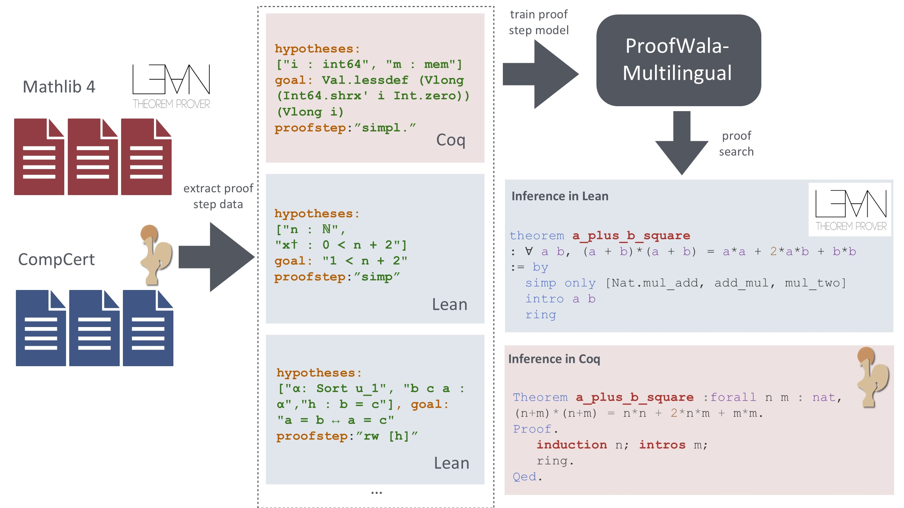

# ProofWala

[](https://github.com/trishullab/proof-wala/actions/workflows/ci.yaml)
[](https://pypi.org/project/proof-wala/)
[](https://pypi.org/project/proof-wala/)

## Introduction
Neural networks have shown substantial promise at automatic theorem-proving in interactive proof assistants (ITPs) like Lean and Coq. However, most neural theorem-proving models are restricted to specific ITPs, leaving out opportunities for cross-lingual transfer between ITPs. We address this weakness with a multilingual proof framework, <span style="font-variant:small-caps;">ProofWala</span>, that allows a standardized form of interaction between neural theorem-provers and two established ITPs (Coq and Lean). It enables the collection of multilingual proof step data---data recording the result of proof actions on ITP states---for training neural provers. 
 <span style="font-variant:small-caps;">ProofWala</span> allows the systematic evaluation of a model's performance across different ITPs and problem domains via efficient parallel proof search algorithms. We show that multilingual training enabled by <span style="font-variant:small-caps;">ProofWala</span> can lead to successful transfer across ITPs. 

 ## Framework Details
 <span style="font-variant:small-caps;">ProofWala</span>, a unified framework for extracting and organizing training data for formal theorem proving in <span style="font-variant:small-caps;">Lean</span> and <span style="font-variant:small-caps;">Coq</span>. The framework supports the generation of training data for these ITPs from any formal theorem-proving Git repository (such as Mathlib, CompCert, MathComp, GeoCoq, & Category Theory) and the subsequent training of LLMs for single proof step generation. Our data collection format is standardized across ITPs, and we have created generic prompt formatting schemes across different ITPs and domains. The framework also helps with end-to-end proof search and collection of the annotated proof trees which can be further used for analysis and visualization.

 Our framework has three components: 
(i) the **interface module**: for the execution of proof steps (tactics) on various ITPs (see [ITP Interface Repository](https://github.com/trishullab/itp-interface)), (ii) the **proof step generation & training module**: for generating proof step data and training proof step generation model, and (iii) the **parallel proof search module**: for using the guidance from proof step generation model to do end-to-end the proof search. The Figure below shows the interaction between our different modules.



## Quick Installation
1. Pip install the package:
```bash
pip install proof-wala
```

2. Install the itp-interface dependencies: (follow the instructions in the [itp-interface repository](https://github.com/trishullab/itp-interface) for more details and custom version of Lean 4 and Coq installation)
```bash
install-lean-repl
install-itp-interface
```
>Note: The above step will only install Lean 4 and interface with Lean 4. To enable both Lean 4 and Coq interface, follow the instructions in the [itp-interface repository](https://github.com/trishullab/itp-interface).

3. Install pytorch dependency. This cannot be installed via `pip install proof-wala` as it requires the user to install the correct version of torch based on the CUDA version and the GPU availability. (See the official [pytorch website](https://pytorch.org/) for more details). For example, to install pytorch of CUDA 12.4, run the following command:
```bash
pip install torch==2.5.0 torchvision==0.20.0 torchaudio==2.5.0 --index-url https://download.pytorch.org/whl/cu124
```
>NOTE: The above command is for CUDA 12.4, for other CUDA versions, please refer to the [pytorch website](https://pytorch.org/).
>>NOTE: For example, to install pytorch for CUDA 12.2, run the following command:
```bash
pip install torch==2.5.0 torchvision==0.20.0 torchaudio==2.5.0 --index-url https://download.pytorch.org/whl/cu121
```

4. Test the installation by running the following command:
```bash
python -c "import torch; print(torch.__version__); print(torch.cuda.is_available())"
```

5. If you don't want to train the model and just want to download the pre-trained model, you can download next proof step prediction model from huggingface model hub:
```python
from transformers import AutoModelForSeq2SeqLM, AutoTokenizer
from transformers import pipeline
model_name = "amitayusht/ProofWala-Multilingual"
model = AutoModelForSeq2SeqLM.from_pretrained(model_name)
tokenizer = AutoTokenizer.from_pretrained(model_name)
pipeline = pipeline("text2text-generation", model=model, tokenizer=tokenizer, device=0) # device=0 for GPU, -1 for CPU

# Example usage
state = """
Goals to prove:
[GOALS]
[GOAL] 1
forall n : nat, n + 1 = 1 + n
[END]
"""
result = pipeline(state, max_length=100, num_return_sequences=1)
print(result[0]['generated_text'])
# Output:
# [RUN TACTIC]
# induction n; trivial.
# [END]
```

>NOTE: Our proof step generation model is trained on the multilingual proof step data is available at the [huggingface model hub](https://huggingface.co/amitayusht/ProofWala-Multilingual).

5. You need to install `graphviz` for visualization of the proof trees. You can install it using the following command:
```bash
sudo apt-get install graphviz
```

## Running the Proof Search
1. After installing the `proof-wala package`, you can run the parallel proof search by first starting the ray cluster. This step is needed if the ray cluster is not already running. To start the ray cluster, run the following command:
```bash
proof-wala-init-ray --num_cpus 20 --object_store_memory 53687091200 --memory 53687091200 --metrics_report_interval_ms 300000000 &
# ^This process needs to run in background. It will start the ray cluster and save the session details in the .log/ray/session_latest file
# ^You can also create the session file with info of an existing ray cluster without starting a new one, by providing the session details in the .log/ray/session_latest file
```

>NOTE: The command `proof-wala-init-ray` actually runs `src/proof_wala/main/init_ray.py`.

>NOTE: Make sure to delete the `.log/ray/session_latest` file if you want to start a new ray cluster. Otherwise the new ray cluster will use the existing session details and might cause issues.

>NOTE: for the `session_latest` file, we use the following json format:
```json
{
    "node_ip_address": "128.83.141.189", 
    "raylet_ip_address": "128.83.141.189", 
    "redis_address": null, 
    "object_store_address": "/tmp/ray/session_2025-01-30_18-30-47_764457_139622/sockets/plasma_store", 
    "raylet_socket_name": "/tmp/ray/session_2025-01-30_18-30-47_764457_139622/sockets/raylet", "webui_url": "127.0.0.1:8265", 
    "session_dir": "/tmp/ray/session_2025-01-30_18-30-47_764457_139622", "metrics_export_port": 64063, 
    "gcs_address": "128.83.141.189:61362", 
    "address": "128.83.141.189:61362", "dashboard_agent_listen_port": 52365, 
    "node_id":"1d44a4b8ce6d2bbf51077e7289b648315c291bbaba1d7dc9aa4c6497", 
    "main_pid": 139622
}
```

2. Build the Lean/Coq project before running the proof search. For example, to build the example Lean project, run the following command:
```bash
cd src/proof_wala/data/proofs/lean/lean4_proj
lake build
```

3. To run the parallel proof search module, run the following command from the root directory:
```bash
export FOLLOW_SEED="True"
export CUDA_VISIBLE_DEVICES="0,1,2,3" # Based on the number of GPUs available
proof-wala-search --config-dir=src/proof_wala/main/config --config-name=eval_simple_lean_test_multilingual.yaml
#^ This will automatically start the proof search on the ray cluster mentioned in the session_latest file
#^ For a distributed run we assume that each node has access to the same data, models, essentially the same file system (NFS, SMB, etc)
```
>NOTE: The command `proof-wala-search` actually runs `src/proof_wala/main/run_proof_search.py`.

> NOTE: The config file `eval_simple_lean_test_multilingual.yaml` ([src/proof_wala/main/config/eval_simple_lean_test_multilingual.yaml](src/proof_wala/main/config/eval_simple_lean_test_multilingual.yaml)). You can change the config file based on your requirements. These config files are based on hydra configuration system. For more details on the hydra configuration system, refer to the [hydra documentation](https://hydra.cc/docs/intro).

> NOTE: The `<root>` macro mentioned in the config files can be set using the environment variable `ROOT` or one can directly replace the `<root>` with the path to relevant directory in the config file.

## Training the Proof Step Generation Model

1. First generate the proof step data by following the instructions in the [itp-interface repository](https://github.com/trishullab/itp-interface).

2. To train the model for proof step generation, run the following command from the root directory:
```bash
torchrun --nproc-per-node 2 --master-port 31052 proof-wala-train --config-dir=src/proof_wala/main/config --config-name multilingual_random_base_experiment.yaml
# ^ This will run training on 2 GPUs, on the same node
# ^ For a single node or no GPU training just remove the --nproc-per-node 2 and --master-port 31052 and torchrun
# The above training job can also be run on a slurm cluster/(or any distributed cluster), for that refer the per_node_job.sh and tacc_slurm.sh script in the root directory
```
>NOTE: The command `proof-wala-train` actually runs `src/proof_wala/main/run.py`.

>NOTE: Check the `multilingual_random_base_experiment.yaml` configuration in the [src/proof_wala/main/config](src/proof_wala/main/config) directory for the exact details of the training configuration and where the model will be saved, the location where it expects the data to be present, etc. These config files are based on hydra configuration system. For more details on the hydra configuration system, refer to the [hydra documentation](https://hydra.cc/docs/intro).

> NOTE: The `<root>` macro mentioned in the config files can be set using the environment variable `ROOT` or one can directly replace the `<root>` with the path to relevant directory in the config file.

## Our Paper
For more details, please refer to our paper: [ProofWala: Multilingual Proof Data Synthesis and Theorem-Proving](https://arxiv.org/abs/2502.04671).

```bibtex
@misc{thakur2025proofwala,
      title={${\rm P{\small ROOF}W{\small ALA}}$: Multilingual Proof Data Synthesis and Theorem-Proving}, 
      author={Amitayush Thakur and George Tsoukalas and Greg Durrett and Swarat Chaudhuri},
      year={2025},
      eprint={2502.04671},
      archivePrefix={arXiv},
      primaryClass={cs.AI},
      url={https://arxiv.org/abs/2502.04671}, 
}
```